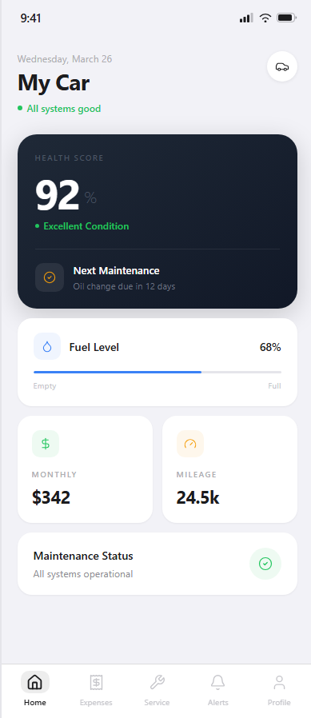
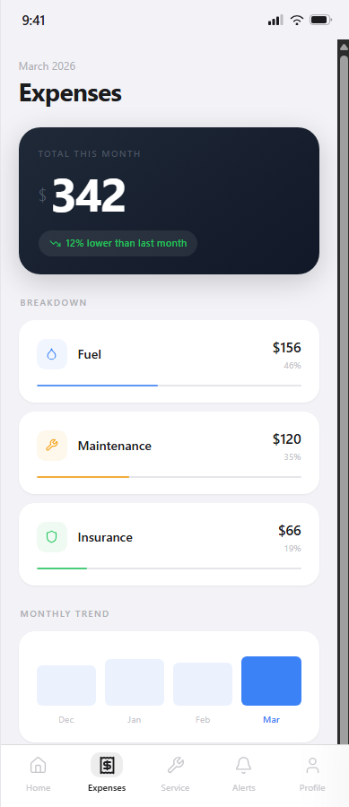
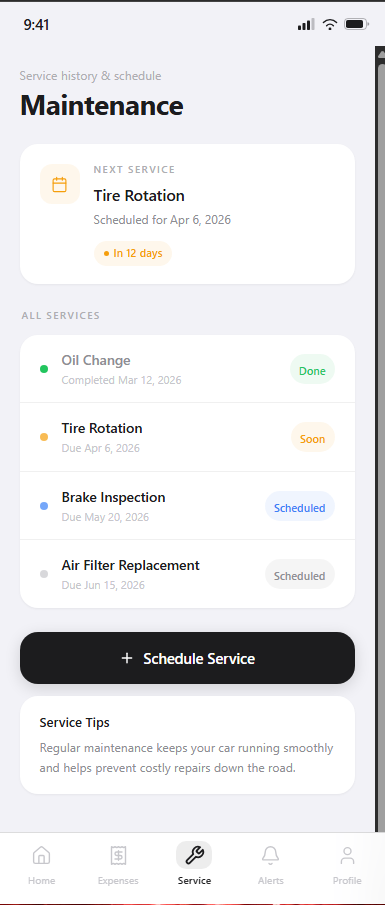
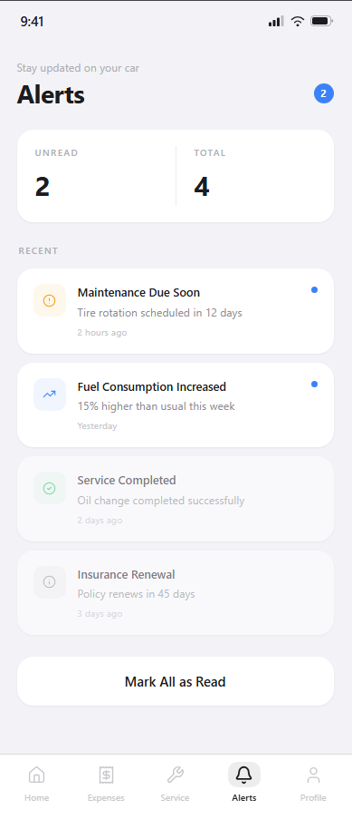
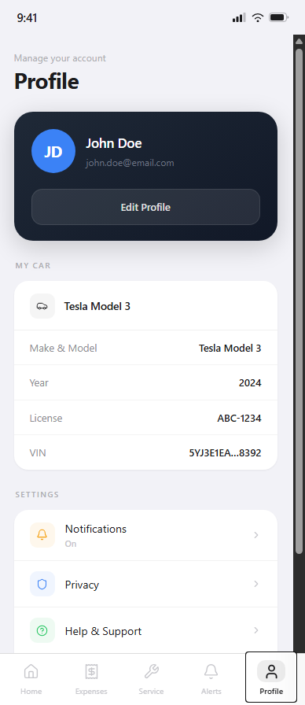

# CarSync

CarSync is a Flutter mobile application designed to help users manage and track their vehicle maintenance, expenses, alerts, and profile information in one centralized platform.

## Overview

CarSync provides a comprehensive solution for vehicle owners to keep track of maintenance schedules, monitor expenses, receive important alerts, and manage their vehicle profiles. The application combines intuitive design with practical functionality to simplify vehicle management.

## Features

- Authentication: Secure user login and registration system
- Home Dashboard: Overview of vehicle status and recent activities
- Maintenance Tracking: Schedule and monitor vehicle maintenance tasks
- Expense Management: Track and categorize vehicle-related expenses
- Alert System: Receive notifications for important vehicle events
- Profile Management: Manage user and vehicle profile information

## Requirements

Before you begin, ensure you have the following installed on your system:

- Flutter SDK (version 3.5.0 or higher)
- Dart SDK (included with Flutter)
- A suitable IDE (Visual Studio Code, Android Studio, or IntelliJ IDEA)
- For Android development: Android SDK and Android Studio
- For iOS development: Xcode (macOS only)

## Installation

Follow these steps to set up the project on your local machine:

1. Clone the repository:
```bash
git clone <repository_url>
cd CarSync
```

2. Install Flutter dependencies:
```bash
flutter pub get
```

3. Generate launcher icons (optional):
```bash
flutter pub run flutter_launcher_icons
```

## Running the Application

### On Android Emulator or Device

1. Start an Android emulator or connect a physical Android device
2. Run the application:
```bash
flutter run
```

### On iOS Simulator or Device (macOS only)

1. Start the iOS simulator:
```bash
open -a Simulator
```

2. Run the application:
```bash
flutter run
```

### On Web

To run the application in a web browser:
```bash
flutter run -d web
```

### Release Build

To create a production build:

For Android:
```bash
flutter build apk --release
```

For iOS:
```bash
flutter build ios --release
```

For Web:
```bash
flutter build web
```

## Project Structure

The project is organized as follows:

```
lib/
  main.dart                 # Application entry point
  core/
    app_colors.dart        # Color definitions
    app_theme.dart         # Theme configuration
  features/
    alerts/                # Alert feature module
    auth/                  # Authentication feature module
    expenses/              # Expense tracking feature module
    home/                  # Home dashboard feature module
    maintenance/           # Maintenance tracking feature module
    profile/               # Profile management feature module
  layout/
    app_layout.dart        # Main layout structure
  models/                  # Data models
  navigation/              # Route configuration
  services/                # Business logic and API services
  widgets/                 # Reusable UI components
```

## Dependencies

Key dependencies used in this project:

- flutter: Flutter framework
- go_router: Navigation and routing
- lucide_icons_flutter: Icon library
- google_fonts: Custom fonts
- http: HTTP client for API calls
- shared_preferences: Local data persistence
- cupertino_icons: iOS-style icons

## Configuration

### Android Configuration

Edit `android/app/build.gradle` to configure:
- Minimum SDK version
- Target SDK version
- Application ID
- Version name and code

### iOS Configuration

Edit `ios/Runner/Info.plist` to configure:
- Application name
- Permissions
- URL schemes
- Other platform-specific settings

## Building and Testing

To run the test suite:
```bash
flutter test
```

To run tests with coverage:
```bash
flutter test --coverage
```

## Troubleshooting

### Common Issues

1. Flutter not found:
   - Ensure Flutter SDK is installed and added to your PATH
   - Run `flutter doctor` to check your setup

2. Pod installation errors (iOS):
   - Navigate to the ios folder and run `pod install`
   - Delete the Pods folder and run `pod install` again if needed

3. Build errors:
   - Clean the build: `flutter clean`
   - Get dependencies again: `flutter pub get`
   - Run the app: `flutter run`

4. Module not found errors:
   - Ensure all dependencies are installed: `flutter pub get`
   - Check that pubspec.yaml has all required packages

## Development Workflow

1. Create a new branch for your feature:
```bash
git checkout -b feature/your-feature-name
```

2. Make your changes and test them:
```bash
flutter test
flutter run
```

3. Commit your changes:
```bash
git commit -m "Add your commit message"
```

4. Push to your branch:
```bash
git push origin feature/your-feature-name
```

5. Create a pull request

## Code Style

This project follows Flutter and Dart best practices. Use the analyzer to check for issues:
```bash
flutter analyze
```

## Documentation

For more information, refer to:
- Flutter Documentation: https://docs.flutter.dev
- Dart Documentation: https://dart.dev/guides
- Go Router Documentation: https://pub.dev/packages/go_router

## License

This project is private and not intended for public distribution.

## Contact

For questions or support, please contact the project maintainer.

## Wireframes

Below are the app wireframes/screens captured from the Figma mockups. To display the images here, place the exported PNG files in `assets/screenshots/` with the filenames shown below.

- Home: `assets/screenshots/home.png`
- Expenses: `assets/screenshots/expenses.png`
- Maintenance: `assets/screenshots/maintenance.png`
- Alerts: `assets/screenshots/alerts.png`
- Profile: `assets/screenshots/profile.png`

If you add those files to the repository, they will render in this README automatically. Example markup (already included below) will show the images in order.

### Visual Preview











Notes:
- Recommended export size: 390px wide (mobile artboard width) for best balance between quality and file size.
- Keep filenames exactly as listed above so the links work out-of-the-box.
